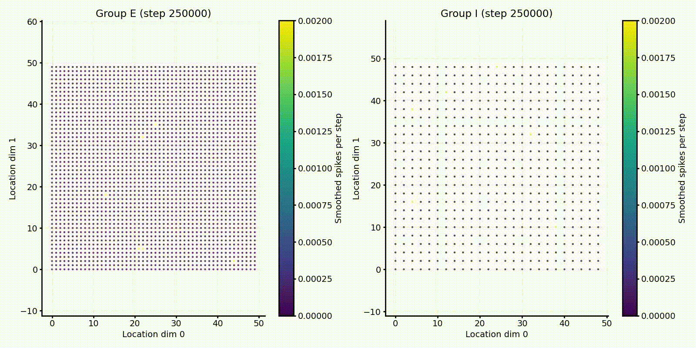
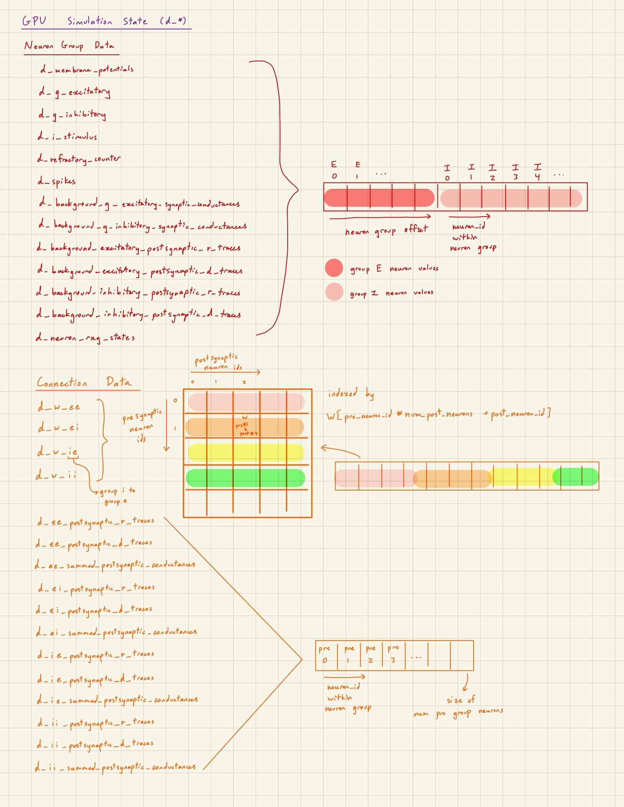
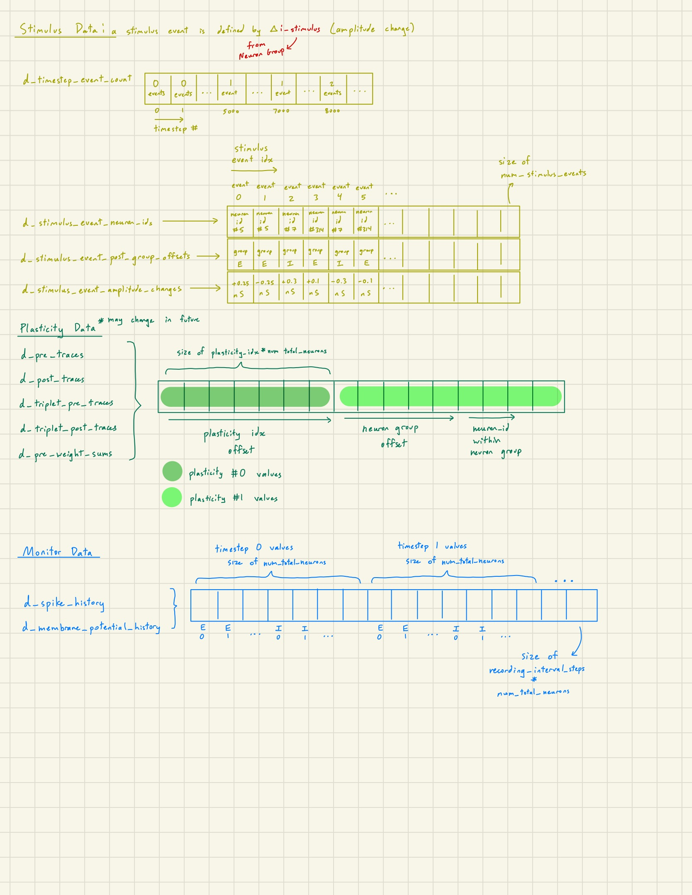
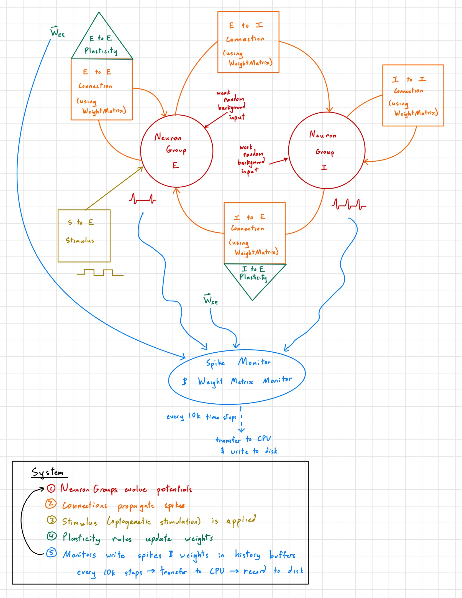
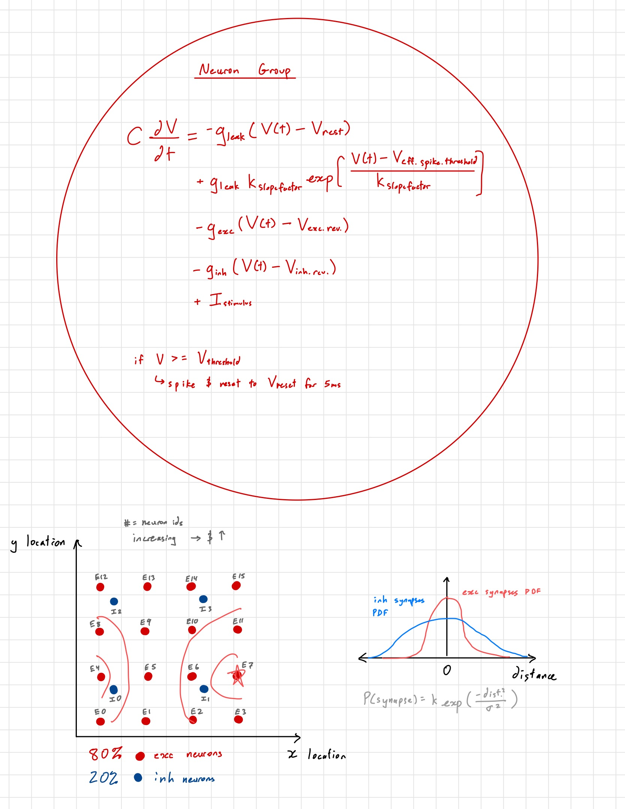
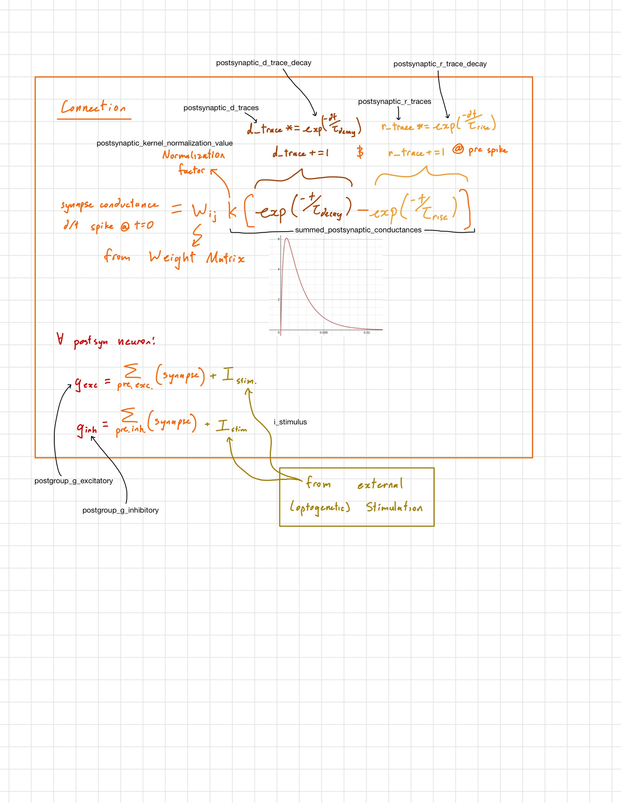
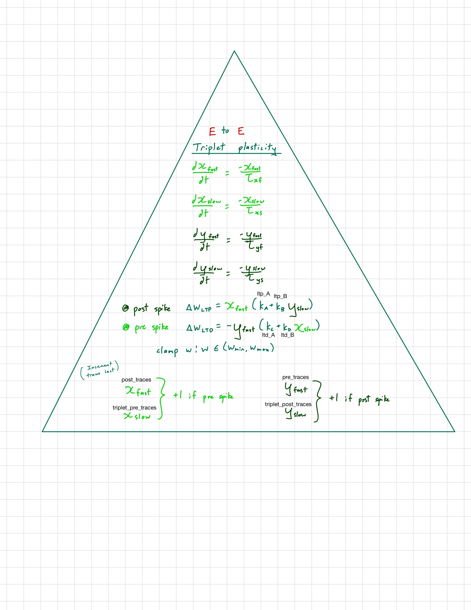
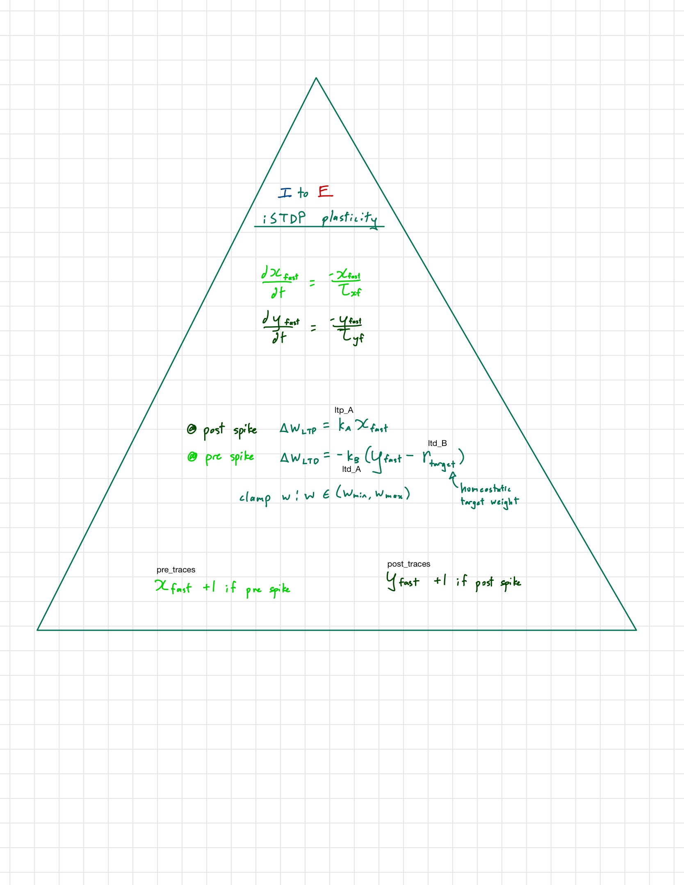

# Docs
Conductance-based exponential integrate-and-fire (EIF) neurons in excitatory and inhibitory populations, distance-dependent random connectivity, and spike-timing-dependent plasticity (triplet STDP on E→E synapses, inhibitory STDP on I→E synapses). The example config run 3,125 neurons (2,500 E + 625 I) with four dense weight matrices (~9.8M synapse entries) at a 0.1 ms timestep



- All simulation state lives on GPU; the CPU host builds the network, launches kernels, and writes recordings to disk. `GpuSimulationState` allocates every device buffer up front as structure-of-arrays (one array per state variable across all neurons), owns the cuBLAS handle and the cuRAND states, is non-copyable, and frees everything in the destructor



- Each component (`NeuronGroup`, `Connection`, `Stimulus`, `Plasticity`, monitors) builds a small POD `*View` struct of parameters and device pointers into the shared buffers, and passes it to its kernels by value e.g. a neuron group is just an `offset` + `num_neurons` slice.
- `System` owns every component through `std::unique_ptr` and calls them in a fixed order each step, so adding a learning rule or a recorder doesn't touch the step loop
- Monitors write each step's spikes and voltages into a device-side ring buffer and copy it to the host once per `recording_interval_steps` (10,000 steps = 1 s simulated)


# Reqs
- __Simulation__:
  - Linux with NVIDIA GPU. Makefile  uses `-arch=sm_89` (RTX 40-series) right now
  - CUDA Toolkit 11.8+ (cuBLAS, cuRAND)
  - C++17 and OpenMP
- __Analysis notebooks__: python 3.11.6 and `pip install numpy ipykernel matplotlib opencv-python`.

### Build and run
```bash
make                                            # builds bin/main_buryn
mkdir -p ../data/buryn_data                     # output root used by the example configs (outside the repo)

./bin/main_buryn configs_to_run/config00.json   # run one config
bash bash_src/run_simulations.sh                # run every config in configs_to_run/
```
- Run from repo root; the paths in the configs are relative to that
- At startup the binary should print the total GPU memory it allocated. During the run it prints `Completed clock step: <step> | elapsed: <seconds>s`
- Each run deletes and recreates its `output_directory` then copies its config into it

### Configuration
Each run is one JSON file. Defaults in `cpp_src/core/config.h`.

| Group | Keys | Notes |
|---|---|---|
| Run | `simulation_steps`, `timestep`, `rng_seed`, `output_directory`, `description` | `timestep` in seconds (`1e-4` = 0.1 ms) |
| Neurons | `num_excitatory_neurons`, `num_inhibitory_neurons`, `g_leak`, `membrane_capacitance`, `v_*`, `refractory_steps` | SI units (S, F, V) |
| Layout | `excitatory_side_points`, `inhibitory_side_points`, `*_location_spacing` | neurons sit on square 2D grids |
| Connectivity | `{e_to_e,e_to_i,i_to_e,i_to_i}_max_weight_value`, `_max_distance`, `_spread_scale`, `_probability_multiplier`, ... | Gaussian connection probability by distance |
| Synapses | `tau_rise_e`, `tau_decay_e`, `tau_rise_i`, `tau_decay_i` | difference-of-exponentials conductance |
| Plasticity | `e_e_plasticity_*` (triplet STDP), `i_e_plasticity_*` (iSTDP) | toggle each with `*_enabled` |
| Stimulus | `stimulus_selected_input_ids`, `stimulus_start_clock_steps`, `stimulus_end_clock_steps`, `stimulus_input_values` | square current pulses; a single value is reused for every pulse |
| Recording | `*_recording_file`, `voltage_recording_neuron_ids` | |

`simulation_steps` is a multiple of 10,000 plus one (e.g. `10001`) so that the last 1 s recording window is written out.

# System

- In System::step_the_clock, the sequence is: evolve neurons → propagate connections → propagate stimuli → update plasticity → record monitors. Note that this means stimuli set by Stimulus::propagate_stimulus() affect the next step's evolve().

# Neuron Groups


### distance planning
90 x 90 = 8100 grid points for about a 1mm square, then each 9 side grid points is a distance of 100um.
(according to 8000 excitatory neurons in a L2/3 1mmx1mm and 100um deep volume).
Using $P_K^\lambda({i,j}) \sim C\exp(\frac{-d_{ij}^2}{S})=N(0, \sqrt{0.5S})$


# Connections


### kernel_connection_propagate for $\sum_\text{pre} (\text{synapse})$
- weight matrix $\bold{\underline{A}}$ in GPU is row-major like weight_matrix[pre_neuron_id * num_post_neurons + post_neuron_id]
- cuBLAS expects column-major order so re-interpret weight_matrix as column-major matrix A with shape [post, pre] such that $\bold{\underline{A}} = \bold{\underline{W}}^T$ (by using option CUBLAS_OP_N)
- each new postsynaptic conductance is $\Delta_{\text{from this connection}} g_{\text{post neuron}} = \sum_\text{pre} (\text{synapse}) = \sum_\text{pre} W[\text{pre}, \text{post}] x[\text{pre}] = \sum_\text{pre} A[\text{post}, \text{pre}] x[\text{pre}] = \bold{\underline{A}}\vec{x}$ where $x[\text{pre}]$ is the computed postsynaptic conductance for that pre neuron.
- GEMV calculates $\vec{y} = \alpha \bold{\underline{A}}\vec{x} + \beta \vec{y}$ so we will use: $\vec{y} =$ post_group's g (either excitatory or inhibitory depending on pre_group) and $\vec{x} =$ summed_postsynaptic_conductances
- cublasSgemv:
    - cuBLAS handle
    - CUBLAS_OP_N cuBLAS expects column-major order so re-interpret weight_matrix as column-major matrix A with shape [post, pre]
    - m=num_post_neurons number of rows of A
    - n=num_pre_neurons number of columns of A
    - alpha=1
    - A=weight_matrix
    - lda=post leading dimension of A (number of rows in column-major order)
    - x=summed_postsynaptic_conductances of shape [pre, 1]
    - incx=1 increment for elements of x (not 1 means every incx-th element is used)
    - beta=1
    - y=target_post_group_g
    - incy=1 increment for elements of y (not 1 means every incy-th element is used)
- Note that inhibitory weight matrix values are still positive. Instead, to have inhibitory synapses, the connection must have pre_group_inhibitory bool set to true, and the inhibition occurs via adding to g_inhibitory_ (using add_g_inhibitory()) of the postsynaptic neuron group.

### postsynaptic conductance values
- $G^{\lambda}(t)=(\exp(-t/\tau_d^{\lambda}) - \exp(-t/\tau_r^{\lambda})) * (N)$
- $G^{\lambda}(t)=(\exp(-t/0.002) - \exp(-t/0.0003)) * (1.7)$
- $G^E(t) \approx 1.0 \text{ms}^{-1}$ @ $t=0.6\text{ms}$
- $K_{ij}^E=1.0*10^{-9}$ for large synapse
- $K^E*G^E \approx 1.0 \text{nS}$ for sort of close to biologically realistic magnitude (around 0.1-1nS)


# Plasticities




# References
- https://www.youtube.com/watch?v=2NgpYFdsduY&list=PLxNPSjHT5qvtYRVdNN1yDcdSl39uHV_sU
- https://www.youtube.com/watch?v=h9Z4oGN89MU threads, blocks, grid, cores, warps, SMs
- https://www.youtube.com/watch?v=MVutNZaNTkM&list=PLxNPSjHT5qvtYRVdNN1yDcdSl39uHV_sU&index=7 cuRAND and cuBLAS
- https://forums.developer.nvidia.com/t/undefined-reference-to-cublascreate-v2/23799/3
